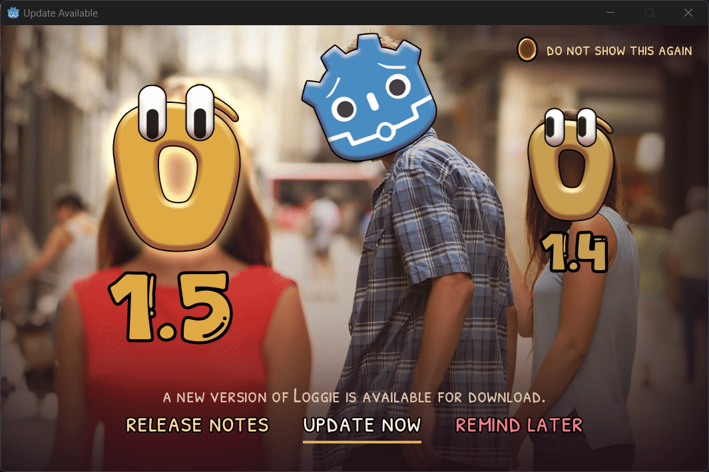
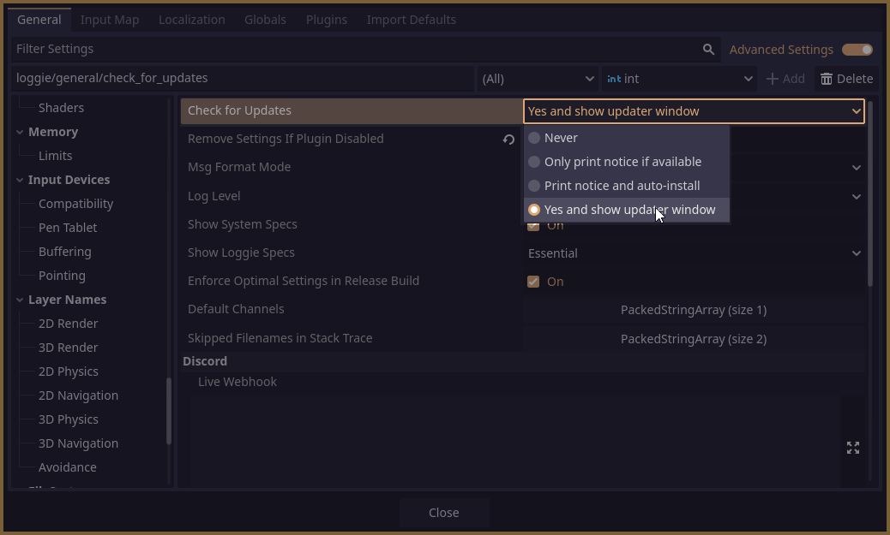

# Auto Updater

Because Godot, as of 4.4, still doesn't have an automatic plugin version manager, this new feature was developed for Loggie 2.0 *(thus you still need to manually update from 1.X to 2.X+ manually)*.

The auto updater's duty is to inform you if there is a Loggie update available, and optionally install it automatically, or with your manual verification, by downloading it from the official Loggie GitHub repository.

The auto updater comes enabled by default, set to a mode that gives you the most options and requires your manual verification to proceed.

> I believe this is the best default, since it lets the user know that the auto-updater exists, while allowing them full agency over what to do next.

---

The auto updater can operate in 4 modes:
### Never
In this mode, Loggie will never check for updates, nor notify you about them. 
It's like this feature doesn't exist.

### Only Print Notice if Available
In this mode, Loggie will check for updates, and if an update is available, will send an `info` message like:

#### Print Notice and Auto-Install
In this mode, Loggie will check for updates, and if an update is available, will instantly start updating. You may see `info` messages like:

### Show Updater Window
In this mode, Loggie will check for updates, and if an update is available, will pop up a window like:

Here you can choose how to proceed, including by disabling the window from showing up by setting "Do Not Show This Again".
This will change the mode to **Only Print Notice if Available**.

You can choose which mode you want to use in **Project Settings -> Loggie -> General -> Check For Updates**:

## Applying The Update

After you perform an auto update, your entire `loggie` directory (usually in `res://addons/loggie`) will be removed and replaced with the new files downloaded from the Loggie GitHub repository containing the new update.

The only content from your previous directory that will be preserved is:

> * `loggie/custom_settings.gd`
> * `loggie/channels/custom_channels/`

✔️ These are considered protected files/directories.

> [!CAUTION]
> Exactly due to that, **you should never** store any custom content in the loggie directory, unless it is a protected file / in a protected directory.

## Caveats

Since new files have been downloaded, if you had **any** of the previous files open, this can cause 2 types of issues:

### 1. You may accidentally re-create a file that got deleted.
Let's say, in the previous version of Loggie you were using, the plugin contained a script `loggie_garbage.gd`. 

If you were, for some reason, browsing or editing the `loggie_garbage.gd` script and had it open in your Godot script editor, then applied an update which removed `loggie_garbage.gd` - the script editor will keep that script open.

If you press Save (Ctrl+S), or in any other way Save the state of the script editor, Godot will actually re-create that script file back in its original location.

This can, in some cases, be a source of massive issues, if that deleted script was referring to any resources which are no longer present in the newly downloaded version, or using a removed method, had a conflicting class_name, or any other reason.

### You may accidentally undo the update to some files.
If you were browsing or editing any of the Loggie scripts, you may see a window like this pop up right after the update:

You have to choose **Discard local changes and reload** here. Closing this window or choosing any other option will retain the old version of the files that got changed, effectively undoing the update.

What's even worse, some of your files which weren't noted in this window will remain on their updated version, while the ones that were here will revert, making you have a mix of updated and outdated files, which can chain react into a bunch of other errors.

> [!TIP]
> If this happens, my advice is to completely reinstall Loggie. 
> 
> *(but make sure to preserve a backup of your custom_settings.gd / custom_channels directory and reapply them after installation).*

# Troubleshooting

Aside from the errors that can occur for the reasons mentioned in the **Caveats** section, once the update has been downloaded, Loggie will also disable and re-enable itself.

This can sometimes cause the appearing of other errors, which are temporary and insignificant, but look scary in the console, making it feel like something went horribly wrong with the update:

If this happens, please try the following:

### 1. Reload Current Project

In the Godot top bar, choose **Project -> Reload Current Project**.
This usually deals with it.

### 2. Restart Godot

Sometimes, a simple reload of the current project doesn't work, but a restart of Godot does. 

Don't ask me why, if I had to guess, it's because of something related to the caching of resources, but I didn't research it.

### 3. Full Loggie Reinstall

It is possible that due to a bug, or an unforeseen local device circumstance, the update truly failed or did something critical.

In this case, please remove your `addons/loggie` plugin completely, and install a fresh copy of the newest version manually. Installation instructions can also be found on the [front page](README.md).

If, after installing the newest version manually, you are still experiencing issues, something is seriously wrong with that version of Loggie and should be reported.

Please open an issue, or even better, write about it on the Loggie Discord so we can discuss in details what's going on. I'd love to know about such issues as soon as possible and fix them.

The only remaining option, at that point is:
### 4. Revert to Older Version

You can always access earlier versions of Loggie by downloading them from our [GitHub releases](https://github.com/Shiva-Shadowsong/loggie/releases). 

---
#### Related Articles:
👀 **► [Browse All Features](../ALL_FEATURES.md)**  
📚 ► [Using Custom LoggieSettings](../customization/CUSTOM_SETTINGS.md)

