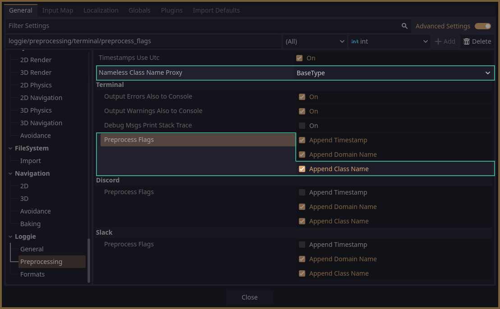

# Class Name Derivation

Class Name Derivation is a feature that allows Loggie to figure out the name of the class from which a message has been sent and display it.

This can greatly enhance your ability to mentally parse the flow and sources of various events in your codebase.


If the script from which a message came doesn't have a `class_name` clause defining a name, you can choose what will be displayed as a replacement.

This replacement is called a `Nameless Class Name Proxy` *(or just `class name proxy` in the rest of this article)*.

> [!WARNING]
> This feature only works if there is a debugger connected to the project while it's running, so it will only be useful during development. 
> 
> This is because this feature requires the usage of the [get_stack](https://docs.godotengine.org/en/stable/classes/class_@gdscript.html#class-gdscript-method-get-stack) function, [whose documentation explains](https://docs.godotengine.org/en/stable/classes/class_@gdscript.html#class-gdscript-method-get-stack) why it depends on the debugger. 
> 
> <u>Therefore, this feature **is automatically disabled** in non-debug builds.</u>

## Using This Feature

To toggle and modify this feature, go to **Project Settings -> Loggie -> Preprocessing** and work with these settings:



If you are [using Custom Settings](../customization/CUSTOM_SETTINGS.md), you can set this in the `load()` method instead:

```
# Set the desired class name proxy:
nameless_class_name_proxy = LoggieEnums.NamelessClassExtensionNameProxy.BASE_TYPE
```

It is not possible to set the usage of the `Append Class Name` flag globally through `custom_settings.gd`, because that flag must be configured on each existing [channel](CHANNELS.md) separately.

>[!NOTE]
>This feature performs better on Godot 4.3+ because it can use the `Script.get_global_name` method to get the class name without needing to read the file. 
>
>If the backwards-compatible alternative approach for class name extraction is used, it may induce a small performance penalty if executed frequently on a variety of uncached classes in a short manner, since it performs a `FileAccess` read.

## Nameless Classname Proxy Types

As mentioned earlier in the article - if a class doesn't have a custom `class_name` - a proxy will be used for that name instead, and you can choose which proxy type you want to use.

Here is what each option means:

| Proxy Type  | Enum Value | Meaning                                                                                                                                     |
| ----------- | ---------- | ------------------------------------------------------------------------------------------------------------------------------------------- |
| NOTHING     | 0          | If there is no `class_name`, nothing will be displayed as a replacement.                                                                    |
| SCRIPT_NAME | 1          | If there is no `class_name`, it will be replaced by the file name of the script whose `class_name` we tried to read. (e.g. `my_script.gd`). |
| BASE_TYPE   | 2          | If there is no `class_name`, it will be replaced by the name of the base type which the script extends (e.g. 'Node2D', 'Control', etc.).    |

---
#### Related Articles:
👀 **► [Browse All Features](docs/ALL_FEATURES.md)** 📚 ► [Prev: Showing Timestamps](docs/features/TIMESTAMPS.md) 📚 ►  [Next: Adding a Stack Trace](docs/features/STACK_TRACING.md)  
📚 ► [Using Custom LoggieSettings](docs/customization/CUSTOM_SETTINGS.md)  
📚 ► [What are Channels?](docs/features/CHANNELS.md)  

👋 *Credits to [ZeeWeasel/LogDuck](https://github.com/ZeeWeasel/LogDuck) for the idea and backwards-compatible implementation.* 