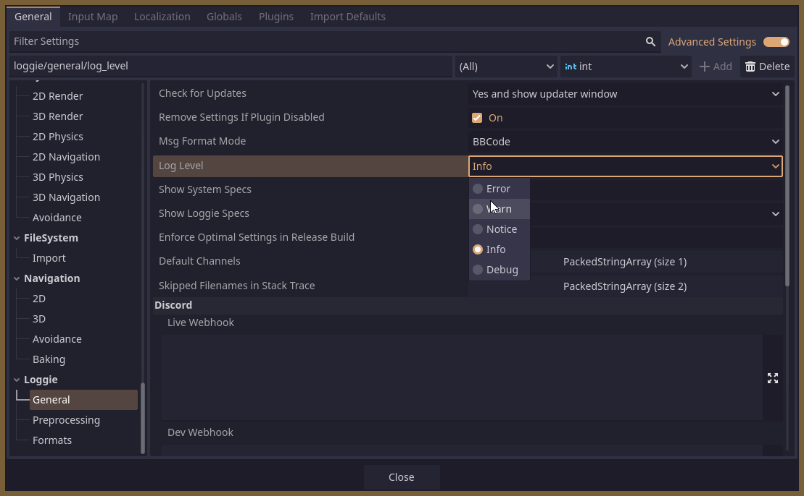
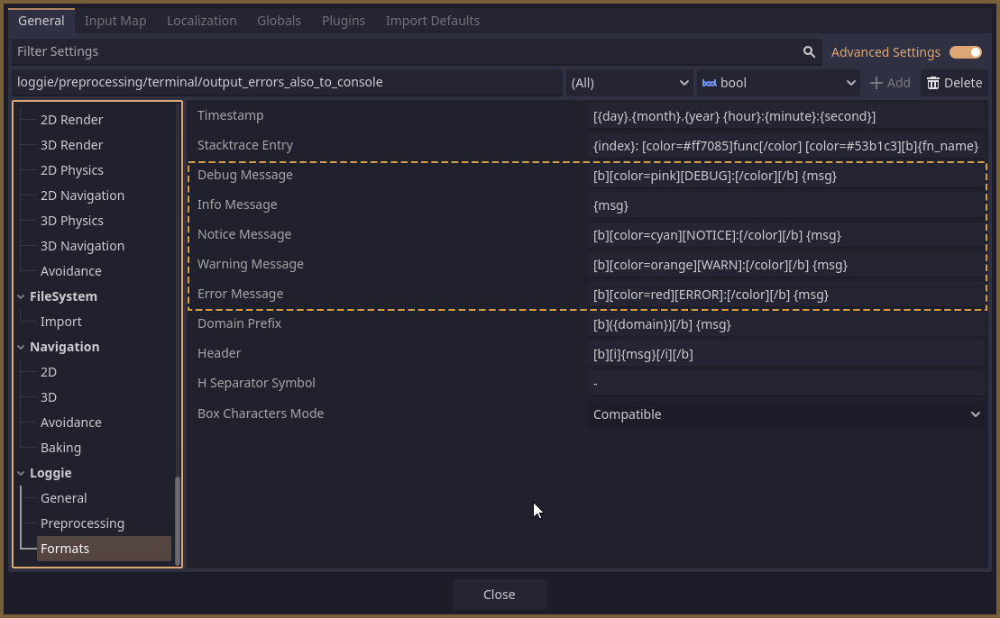

# Log Levels

Log levels are a common concept found in most loggers.
They represent categories of importance for log messages, typically ordered from most critical to least critical. 

They form a hierarchy that can help you, and the logger, better understand the significance of a message, and how to handle such a message internally.

Different levels may be handled and outputted differently. More about that below.

### Available Levels

In Loggie, there are 5 log levels, in order of (most significant -> least significant).
They can be found in the [LoggieEnums.LogLevel](../../addons/loggie/tools/loggie_enums.gd) enum, and they are:

| Log Level | Enum Value | Outputted With Method                 | Description                                                                                                                                                                                                                                                 |
| --------- | ---------- | ------------------------------------- | ----------------------------------------------------------------------------------------------------------------------------------------------------------------------------------------------------------------------------------------------------------- |
| Error     | 0          | Loggie.error()<br>LoggieMsg.error()   | Used for critical errors that prevent normal operation of the application. These are issues that require immediate attention, like failed database connections, critical file system errors, or application crashes.                                        |
| Warn      | 1          | Loggie.warn()<br>LoggieMsg.warn()     | Used for potentially harmful situations that don't stop execution but should be reviewed. Examples include deprecated feature usage, resource consumption warnings, or recoverable errors that might indicate bigger problems.                              |
| Notice    | 2          | Loggie.notice()<br>LoggieMsg.notice() | Used for normal but significant events that should be highlighted. This includes important state changes, configuration modifications, or successful completion of major tasks. Useful for tracking key application events without the verbosity of `info`. |
| Info      | 3          | Loggie.info()<br>LoggieMsg.info()     | Used for general informational messages about normal application operation. This includes startup/shutdown messages, user actions, or routine operations. Helps track the normal flow of the application.                                                   |
| Debug     | 4          | Loggie.debug()<br>LoggieMsg.debug()   | Used for detailed information useful during development and troubleshooting. This includes variable values, function entry/exit points, or execution timing data. Most verbose level, that should typically be disabled in production and release builds.   |

## Using Log Levels

The descriptions in the table above can give you a hint on how each level is typically used in applications.

Loggie requires you to choose and select the levels which you want to enable in your project.

You can do that in the **Project Settings** window of Godot here:



Alternatively, if you are [using Custom Settings](../customization/CUSTOM_SETTINGS.md), you should add this to your `custom_settings.gd` load() method:

```gdscript
# Set the log level used by Loggie:
log_level = LoggieEnums.LogLevel.INFO
```

✔️ Once this is set, messages outputted on the selected log level, or **any level lower than that**, will get logged.

❌ Messages coming from levels higher than the enabled one will be discarded during preprocessing and won't be logged.

>[!NOTE]
>### How is this useful to me?
>For example, while you are developing your game, you may want to see all messages including 'Debug' ones - but you don't want your users to see this if they run your released application and go snooping around the log files on their device.
>
>Good news! You don't need to go and delete all your 'debug' messages throughout your codebase. Simply ensure that undesired levels are turned off by setting the appropriate value for the log level setting.

Once you're done configuring this, you can output messages to any log level using the related methods. For example:

```gdscript
# Shortcut for 'error'. Use if you don't want to apply any other customizations.
Loggie.error("Something is wrong!")

# With customizations:
Loggie.msg("Something is wrong!").bold().italic().error()
```

> [!TIP]
> [Learn more about composing messages here.](COMPOSE_AND_OUTPUT_MESSAGES)
## Functionality Differences

Some log levels are handled differently than others during output to the Godot terminal channel.

| Level  | Note                                                                                                                                                                                                                                                                                                                                                                                   |     |
| ------ | -------------------------------------------------------------------------------------------------------------------------------------------------------------------------------------------------------------------------------------------------------------------------------------------------------------------------------------------------------------------------------------- | --- |
| ERROR  | **Has Toggle**<br>If the setting `Output Errors To Console` is set to `true`, error messages on the `terminal` channel will additionally get output with the `push_error` function, which will also generate an actual error in the Godot debugger tab *(recommended)*.<br><br><br>               |     |
| WARN   | **Has Toggle**<br>If the setting `Output Warnings To Console` is set to `true`, warning messages on the `terminal` channel will additionally get output with the `push_warning` function, which will also generate an actual error in the Godot debugger tab *(recommended)*.<br><br><br><br> |     |
| NOTICE | No special functionality.                                                                                                                                                                                                                                                                                                                                                              |     |
| INFO   | No special functionality.                                                                                                                                                                                                                                                                                                                                                              |     |
| DEBUG  | **Has Stack Tracing Feature**<br>If the setting `Debug Msgs Print Stack Trace` is set to `true`, debug messages on the `terminal` channel will additionally have a stack trace appended to them.<br><br><br>                                                                                      |     |
## Formatting Styles

By default, messages outputted on the existing levels will look like this:


If you wish to change their style, it can be done by altering their format setting:
**Project Settings -> Loggie -> Formats**

The available variables for these fields are:

| variable | meaning                                               |
| -------- | ----------------------------------------------------- |
| {msg}    | This will get replaced by the content of the message. |



If you are [using Custom Settings](../customization/CUSTOM_SETTINGS.md), you can do it with:

```gdscript
format_error_msg = "[b][color=red][ERROR]:[/color][/b] {msg}"
format_warning_msg = "[b][color=orange][WARN]:[/color][/b] {msg}"
format_notice_msg = "[b][color=cyan][NOTICE]:[/color][/b] {msg}"
format_info_msg = "{msg}"
format_debug_msg = "[b][color=pink][DEBUG]:[/color][/b] {msg}"
```

>[!WARNING]
>##### Why did you use such stark ugly colors as defaults?
>
>Loggie was originally developed on Godot 4.3.
>
>Since messages outputted by Loggie are using `print_rich` - I opted to use colors which are officially supported by `print_rich` during internal handling of BBCode stripping, and the choices there are limited in Godot 4.3.
>
>In future versions of Godot, they may fix this to support a broader set / all colors - but for backwards compatibility, I'm keeping the defaults as is.

#### Related Articles:
👀 **► [Browse All Features](../ALL_FEATURES.md)**  📚 ► [Next: Domains](DOMAINS.md)  

📚 ► [Channels](CHANNELS.md)  
📚 ► [Composing Messages](COMPOSE_AND_OUTPUT_MESSAGES.md)  
📚 ► [Using Custom LoggieSettings](../customization/CUSTOM_SETTINGS.md)  
📚 ► [How do Log Levels work?](LOG_LEVELS.md)  